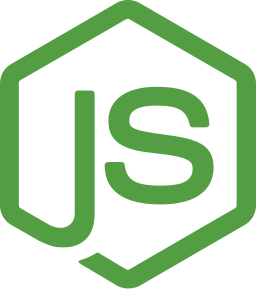

# Cite It
This is a client-side app for "Cite It" project. The app consists of couple of modals and 4 main pages including: Home, News Feed, Movies, and Edit Profile. Modals and several other UI components of the app are animated. App design is mobile friendly. As for static texts, they can be shown in Georgian and English languages.

### Table of Contents

- [Prerequisites](#prerequisites)
- [Tech Stack](#tech-stack)
- [Getting Started](#getting-started)
- [Development](#development)
- [Project Structure](#project-structure)

### Prerequisites

-  Node.js@18 and up
-  npm@9.5 and up

### Tech Stack

-  [Vue-3 (vue-router, vue-i18n)](https://vuejs.org/) - framework for building web user interfaces
-  [VeeValidate](https://vee-validate.logaretm.com/v4) - takes care of value tracking, validation, errors, submissions and more.
-  [Pinia](https://pinia.vuejs.org/) - the intuitive store for Vue.js
-  [Tailwind](https://tailwindcss.com/) - utility-first css framework

### Getting Started

1\. First of all you need to clone cite-it-front repository from github:

```sh
https://github.com/GeekoIsaGeek/cite-it-front
```

2\. Next step requires you to run _npm install_ in order to install all dependencies.

```sh
npm install
```

3\. Now we need to set our env file. Go to the root of your project and execute this command.

```sh
cp .env.example .env
```

And now you should provide **.env** file all the necessary environment variables:

**API:**

> VITE_SERVER_URL=

**Pusher:**

> VITE_PUSHER_APP_KEY=

> VITE_PUSHER_APP_CLUSTER=

### Development

You can run development server by executing:

```sh
  npm run dev
```

### Project Structure

```bash
├─── public
├─── readme
├─── src
│   ├─── assets
│   ├─── components
│   ├─── composables
│   ├─── config
│   ├─── router
│   ├─── stores
│   ├───  utils
│   ├───  views
│   - App.vue
│   - main.js
- .env
- index.html
- postcss.config.js
- README.md
- tailwind.config.js
- vite.config.js
```
